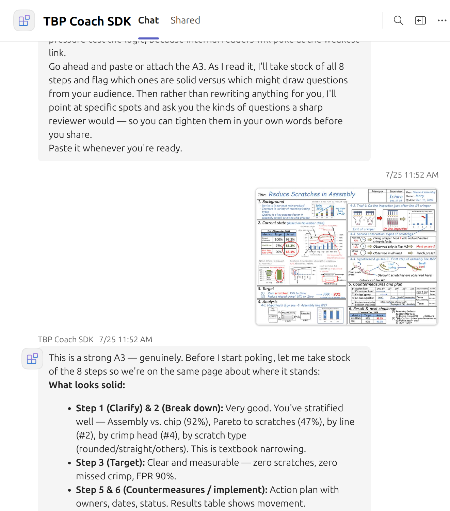

# TBP Coach for Microsoft Teams

A problem-solving coach that lives in Teams and guides a person through **their own real problem** using the Toyota Business Practices (TBP) 8-step method. It works one step at a time, leads with questions, and never hands over the root cause or the countermeasure. That discipline is the method.

Built by [Art Smalley](https://artoflean.com), author of *Four Types of Problems*, *Understanding A3 Thinking*, and *Toyota Kaizen Methods*. The coaching behavior is the open-source [tbp-coach skill](https://github.com/artsmalley/skills); this repository is the Teams packaging of it, built on the Microsoft 365 Agents SDK so it can be deployed inside your own tenant.



*A learner pasted an existing A3. The coach took stock of all eight steps, said which were solid, and then asked questions instead of rewriting anything.*

## What it does

- **Fresh problem:** starts at Step 1 (clarify the problem) and moves forward one step at a time. It does not dump all eight steps, and it does not jump to countermeasures before the problem is defined.
- **Existing work:** paste an A3, notes, data, or a photo of a whiteboard. The coach identifies which steps are already done and coaches from the weakest or most consequential one. It coaches; it does not grade.
- **Stuck learner:** the smallest nudge that unsticks, in strict order. A hint, then a guiding question, then a partial example. Never the answer.
- **Data you provide:** it will help with stratification, Pareto, trends, and what the data suggests. It will not invent data you have not given it.
- **Photos:** send JPEG, PNG, GIF, or WebP pictures of your A3 or chart—up to three per message, at most 4 MB each. If several images are too large together, the coach asks you to send the omitted image separately or use smaller copies. Images are not automatically resized.
- **Documents:** PDF, Word, and Excel attachments are not supported. Paste the relevant text or send screenshots.
- **Reset:** type `start over` to clear the bot's in-memory session. This does not delete the Teams chat transcript, uploaded files, or data retained by the model provider.

The eight steps, in the order the coach enforces: clarify the problem, break down the problem, set a target, analyze the root cause, develop countermeasures, see countermeasures through, evaluate both results and process, standardize successful processes.

## How it is built

Small on purpose. About ten short source files, no database, no external services beyond the model endpoint you configure.

```
skill/SKILL.md            The coach. Plain markdown; the whole behavior lives here.
src/agent.ts              Teams message loop: history, attachments, model call, reply.
src/attachments.ts        Downloads Teams image attachments and validates them.
src/imageLimits.ts        Image size, count, and conversation image-budget limits.
src/providers/            Model adapter: Anthropic (Claude) or Azure OpenAI behind one interface.
src/config.ts             Environment variables.
src/skillPrompt.ts        Loads skill/SKILL.md as the system prompt at startup.
appPackage/               Teams app manifest and icons.
infra/                    Bicep for the Azure App Service and bot registration.
env/                      Toolkit environment files (see "Deploy in your tenant").
```

The coaching flow is: Teams → your Azure App Service (this code) → your configured model endpoint → back. The app also uses Microsoft services for bot authentication, message delivery, and attachment downloads.

## Data handling

Written for the IT and security review, because these are the questions that get asked.

| Question | Answer |
|---|---|
| Where does the code run? | An Azure App Service in **your** subscription and tenant, provisioned by the Bicep in `infra/`. |
| Where do conversations go? | The bot sends conversation context and supported images to the model endpoint you configure: Claude via Microsoft Foundry (formerly Azure AI Foundry), Azure OpenAI, or Anthropic's API directly. Processing location and retention depend on the provider and deployment you choose; using an Azure endpoint does not by itself mean all processing stays within your tenant or region. |
| What does the bot store? | Conversation history is held **in memory** on the App Service, keyed by Teams conversation id. The model is sent the most recent 60 messages of a conversation. The application does not persist conversation history to disk or a database. A restart, a redeploy, or an idle shutdown clears every session (see "Known limits"). Teams transcripts, uploaded files, and any provider retention are separate from this in-memory history. |
| What about images? | Up to three images per message, at most 4 MB each, validated by file signature. Downloads stop if they exceed 4 MB or take longer than 15 seconds per image. Each model request includes at most 12 MB of encoded image data across new and retained images. Images from at most the three most recent image turns are retained; the oldest images are removed first when the byte budget is exceeded, leaving a text marker. Limits use decimal MB (1 MB = 1,000,000 bytes). |
| Where is the model key stored? | As an App Service application setting, written by the Bicep at provision time and encrypted at rest by Azure. It is never in the code, the package, or git. For production, move it to a Key Vault reference; the setting name stays the same. |
| Is any data sent to Art of Lean? | No. The application has no Art of Lean telemetry or analytics and sends no conversations to the author. Microsoft services and the configured model provider handle data under their applicable terms. |
| Who can install it? | Whoever your Teams admin allows. The app package is uploaded through the Teams admin center or sideloaded for a pilot group. |
| Can we rename it? | Yes. Name, description, and icons are in `appPackage/`. The coach's own voice is in `skill/SKILL.md`. Both are yours to edit. |

Before using company information, have your IT team confirm the model deployment's hosting option, processing geography, retention, and applicable terms:

- **Claude through Microsoft Foundry:** Microsoft offers Azure-hosted and Anthropic-hosted deployment options. For both, Anthropic operates the model and acts as an independent data processor; Anthropic's model/API terms apply alongside the applicable Microsoft and Marketplace terms. Azure-hosted processing follows the selected Global or DataZone deployment scope. Anthropic-hosted processing can occur outside Azure and your selected Azure region. See [Microsoft's Claude data-privacy documentation](https://learn.microsoft.com/en-us/azure/foundry/responsible-ai/claude-models/data-privacy).
- **Azure OpenAI:** Microsoft's applicable service and data-protection terms apply. Processing geography and data handling depend on the deployment type and enabled features. See [Microsoft's Azure OpenAI data-privacy documentation](https://learn.microsoft.com/en-us/azure/foundry/responsible-ai/openai/data-privacy).
- **Anthropic's API directly:** Anthropic's applicable commercial and data-processing terms and retention policies apply. See [Anthropic's API data-retention documentation](https://platform.claude.com/docs/en/manage-claude/api-and-data-retention).

`start over` resets the bot's in-memory session; it is not a deletion request to Microsoft or the model provider. Teams transcripts and uploaded files remain subject to your organization's Microsoft 365 retention policies, and provider-held data remains subject to the provider's applicable retention terms.

## Deploy in your tenant

You need a Microsoft 365 tenant where you can sideload or admin-publish a Teams app, an Azure subscription, and a model endpoint. Expect one to two hours the first time.

Each company deploys its own copy into its own Azure subscription and generates its own Teams app package. An app package from the author or another company points to that deployment's bot; it does not create a bot in your environment.

### 1. Prerequisites

- [Git](https://git-scm.com/downloads), to clone the repository
- [Node.js](https://nodejs.org/) 22
- [Microsoft 365 Agents Toolkit](https://aka.ms/teams-toolkit) for VS Code, or its CLI (`npm install -g @microsoft/m365agentstoolkit-cli`)
- An Azure subscription associated with the same Microsoft Entra tenant as the target Microsoft 365 organization. This template uses a user-assigned managed identity for a single-tenant bot. See [Microsoft's authentication guidance](https://learn.microsoft.com/en-us/microsoft-365/agents-sdk/microsoft-authentication-library-configuration-options).
- Deployment permissions to create an App Service plan, App Service, user-assigned managed identity, and Azure Bot in the chosen resource group, and assign that identity to the App Service. If IT creates the resource group for you, ask for deployment access to it; otherwise you also need permission to create the group.
- A Microsoft 365 account permitted to create the app in Teams Developer Portal, plus a Teams administrator who can approve it for the pilot users or enable their custom-app uploads
- A model deployment or direct API account with a working key, available quota, and billing arranged by your organization. Model usage is billed separately from the App Service, including on the free hosting tier.

Before starting, agree with IT on the target tenant, Azure subscription, resource group and region, model provider, and pilot users. Company policies may restrict resource types, regions, or custom apps even when your account has deployment permissions.

### 2. Choose a model provider

Pick one and get its key and endpoint. Provisioning this repository creates the bot's hosting and registration; it does **not** create the model endpoint. For Foundry or Azure OpenAI, deploy an available model first and copy the endpoint and credentials from that resource. Confirm it can answer a test prompt in the provider's playground. For Anthropic direct, confirm your API account has access to the model you select.

| Provider | Set in `env/.env.dev` | Key in `env/.env.dev.user` |
|---|---|---|
| **Claude via Microsoft Foundry** (confirm hosting and data terms above) | `MODEL_PROVIDER=anthropic`, `ANTHROPIC_MODEL=claude-opus-4-8`, `ANTHROPIC_BASE_URL=https://<resource>.services.ai.azure.com/anthropic` | `SECRET_ANTHROPIC_API_KEY` |
| **Claude direct from Anthropic** | `MODEL_PROVIDER=anthropic`, `ANTHROPIC_MODEL=claude-opus-4-8`, `ANTHROPIC_BASE_URL=` (blank) | `SECRET_ANTHROPIC_API_KEY` |
| **Azure OpenAI** | `MODEL_PROVIDER=azure-openai`, `AZURE_OPENAI_ENDPOINT=https://<resource>.openai.azure.com`, `AZURE_OPENAI_DEPLOYMENT=<deployment name>` | `SECRET_AZURE_OPENAI_API_KEY` |

### What works, honestly

- **Tested:** Claude Opus 4.8 (`claude-opus-4-8`) through Azure AI Foundry. That is what the author runs and what the screenshot above shows.
- **Any current Claude model works** by changing `ANTHROPIC_MODEL`. Sonnet is faster and about half the price of Opus at the same generation, and is a sound choice for a coach that asks one question per turn. Opus reads a difficult A3 photo more insightfully. Claude Opus 5 and Sonnet 5 think before they answer by default; that improves the coaching and adds a few seconds per reply.
- **Wired but not yet tested by the author:** Azure OpenAI. The adapter uses the current Azure chat API and should work with GPT-5 family deployments, including images. You would be the first to run it; report what you find.
- **Not wired:** Gemini, OpenAI direct, local models. Each needs a new adapter in `src/providers/` (about 80 lines, use the Azure OpenAI one as the template).

### 3. Configure

```bash
git clone https://github.com/artsmalley/tbp-agent.git
cd tbp-agent
cp env/.env.dev.user.example env/.env.dev.user
```

The commands above work in Bash and PowerShell. Copy the example only when first setting up, so you do not overwrite existing keys.

Edit `env/.env.dev`:

- Set `AZURE_SUBSCRIPTION_ID` to the subscription ID from Azure Portal → Subscriptions.
- Set `AZURE_RESOURCE_GROUP_NAME` to the group agreed with IT. Creating it in Azure Portal first lets you explicitly choose the region. Alternatively, leave this value blank so Toolkit prompts you to select or create a group during provision.
- Set `RESOURCE_SUFFIX` to 1–17 lowercase letters or digits, for example `contosotbp01`. The template prefixes it with `bot`; the resulting App Service name must be globally available.
- Set the provider variables from the table above. Use a Claude model name available to your account, or the exact Azure OpenAI **deployment name**. Keep unused provider variables present but blank.
- Leave the generated IDs blank on the first installation. Toolkit fills them in; preserve them for subsequent deployments of that installation.

Edit `env/.env.dev.user`: fill in `SECRET_ANTHROPIC_API_KEY` or `SECRET_AZURE_OPENAI_API_KEY`. Keep **both** variable names in the file, with the unused key blank. The `.user` file is gitignored and stays on the machine that deploys.

Optional, and recommended for a pilot: rename the app in `appPackage/manifest.json` (`name.short`, `name.full`, `description`) and replace `color.png` and `outline.png` with your own icons. Change the `developer` block to your organization if you prefer the Teams "About" card to show your name.

### 4. Provision and deploy

Sign into both services before provisioning. In VS Code, use the Toolkit sidebar's accounts section to sign into Azure and Microsoft 365. From the CLI:

```bash
atk auth login azure
atk auth login m365
atk auth list
```

Check that these are the intended company accounts and that the Azure subscription selected in `env/.env.dev` belongs to the target tenant. The Azure deployer and Microsoft 365 app creator can be different people. See the [Toolkit CLI reference](https://learn.microsoft.com/en-us/microsoftteams/platform/toolkit/microsoft-365-agents-toolkit-cli) for account commands.

From VS Code, open the Microsoft 365 Agents Toolkit sidebar and run **Provision**, then **Deploy**, with the `dev` environment selected. From the CLI:

```bash
atk provision --env dev
atk deploy --env dev
```

Provision creates the resource group contents (App Service on the free F1 tier, managed identity, bot registration) and writes the generated ids back into `env/.env.dev`. Deploy builds the TypeScript and zip-deploys it. The model key is passed into App Service settings by the Bicep; it is never in the code or the package.

Wait for Provision to succeed before running Deploy. For later code or coaching-skill changes, run Deploy again using the same environment. Deploy alone does not apply changes to model keys or endpoint settings in the local environment files; those runtime settings live in Azure App Service after provisioning.

### 5. Publish to Teams

Build the app package (Toolkit: **Zip Teams app package**, or `atk package --env dev`). Upload the resulting `appPackage/build/appPackage.dev.zip` from **your** provisioned checkout. Then either:

- **Sideload** for a pilot group: Teams → Apps → Manage your apps → Upload a custom app. Requires sideloading to be enabled for those users.
- **Admin publish** for the organization: Teams admin center → Teams apps → Manage apps → Upload new app, then set the permission policy for who sees it.

Verify with a pilot user's account: open the app in personal chat, say hello, then describe a sample problem and send a follow-up. Check that the follow-up uses the earlier context. Send a small JPEG or PNG and ask about it, then type `start over` and begin a different problem. Use sample information for this first check. If anything fails, use the troubleshooting table below.

### Running locally first

To try the coaching locally before provisioning Azure hosting, the Toolkit's **Playground** runs the bot in a browser without a Teams tenant. You still need a working model endpoint and key; model requests use that provider and incur its normal charges.

From the repository folder, create the secret file once:

```bash
cp env/.env.dev.user.example env/.env.playground.user
```

Set the provider, model, and endpoint values in `env/.env.playground` using the same provider table above. In `env/.env.playground.user`, fill in the chosen provider's key and leave the other key blank, keeping both variable names. Then open the repo in VS Code, press F5, and choose **Debug in Microsoft 365 Agents Playground**. Image attachments must be tested in real Teams; the Playground has no attachment downloader.

### Troubleshooting the first installation

| Symptom | What to check first |
|---|---|
| Provision fails with a permission or policy error | Identify the failed step in Toolkit output. Azure resource failures usually require the subscription/resource-group administrator; Teams app creation or publication failures require the Microsoft 365 administrator. Check the signed-in accounts, target tenant, and the specific denied operation or policy. |
| Provision reports a name conflict or unavailable hosting tier | Check whether `bot<RESOURCE_SUFFIX>` is available and whether the selected region/subscription supports the configured App Service tier. If provisioning partially succeeded, inspect the created resources before changing names and retrying. |
| Toolkit reports a missing environment variable | Keep all variables from the supplied environment and secret templates, including unused provider variables with blank values. Check that you are editing files for the selected environment (`dev` or `playground`). |
| Users cannot upload or find the app | Ask the Teams administrator to check custom-app upload settings or app availability for those users. Confirm they are using the target organization's Teams account. |
| App installs but gives no reply, or Teams says “Failed to send” | Confirm Deploy succeeded and the App Service is running. Check its logs using the section below. In Azure Bot configuration, verify the messaging endpoint is `https://<BOT_DOMAIN>/api/messages` and the Teams channel is enabled. Confirm the uploaded package belongs to this deployment. |
| Bot says “Something went wrong reaching the model” | Inspect App Service logs for the underlying error. Check the selected provider, key, endpoint, model/deployment name, and quota. Authentication errors, unavailable models, and rate limits require different fixes. Azure runtime values are in the App Service environment variables/application settings; editing a local `.env` file and running Deploy does not update them. |
| Text works but an attachment does not | First try a small JPEG or PNG in personal Teams chat. Read the bot's attachment message and application logs. Playground cannot download Teams attachments. |

When asking for help, include the failed step and a redacted error message. Remove keys, access tokens, attachment download URLs, and company conversation content from shared logs.

## Customizing for your organization

This is a standard version of the eight-step method, similar in structure to Toyota Business Practices. It is not endorsed by or affiliated with Toyota. Most companies already have their own problem-solving template and their own names for the steps, and the coach works better when it speaks that language. We suggest you rename it and adapt the content to your organization.

**Rename the app.** Edit `appPackage/manifest.json`: `name.short`, `name.full`, and the two `description` fields. Replace `appPackage/color.png` and `appPackage/outline.png` with your own icons. Change the `developer` block so the Teams "About" card shows your organization. Then rebuild the package and re-publish.

**Change the steps and the content.** The whole coaching behavior is `skill/SKILL.md`, a plain markdown file. Nothing in the TypeScript decides how the coach behaves. Edit that file and run **Deploy** again to change:

- the step names, count, and order, so they match your company's template
- the opening message and the coach's tone
- the questions it asks at each step and what it treats as "done" for a step
- company terminology, example problems, and any house rules

Keep your edits in a separate section at the bottom of the file so a merge with a newer upstream version stays easy. The method's version history is in the [skills repository CHANGELOG](https://github.com/artsmalley/skills/blob/main/CHANGELOG.md).

## Updating the coach

The coaching method improves over time. To update:

1. Take the new `SKILL.md` from [artsmalley/skills](https://github.com/artsmalley/skills/tree/main/skills/tbp-coach).
2. Replace `skill/SKILL.md`.
3. Run **Deploy** again.

The version history and what changed in each release is in that repository's [CHANGELOG](https://github.com/artsmalley/skills/blob/main/CHANGELOG.md). If you have adapted the skill for your organization, keep your edits in a separate section at the bottom of the file so a merge stays easy.

### Seeing the bot's logs

The App Service ships with application logging off. To watch the bot's console output, including the startup line that confirms the skill file loaded, turn it on once and then stream:

These commands require the [Azure CLI](https://learn.microsoft.com/en-us/cli/azure/install-azure-cli), which is separate from Toolkit. Sign in with `az login --tenant <tenant ID>` and select the deployment subscription with `az account set --subscription <subscription ID>`. Find the App Service name in Azure Portal or in `BOT_AZURE_APP_SERVICE_RESOURCE_ID` in `env/.env.dev` (the segment after `/sites/`).

```bash
az webapp log config --name <app service name> --resource-group <resource group> --application-logging filesystem --level information
az webapp log tail --name <app service name> --resource-group <resource group>
```

The startup line looks like `[skill] loaded .../skill/SKILL.md (7813 chars)`; the number is the file's size and changes with each skill update. If it says the skill file was not found, the deploy did not include the `skill/` folder.

## Sessions and memory: what happens without storage

This version has no database. Read this before the pilot so nobody is surprised.

**Where a session lives.** Each conversation's history is a list in the running program's memory. Teams keeps the chat transcript on screen, but the bot never reads it back; it only knows what is in its own list.

**When the list is lost.** Whenever the program stops:

| Event | Tier | Sessions lost? |
|---|---|---|
| About twenty minutes with no messages from anyone | F1 (free) | Yes |
| Redeploy, restart, or Always On turned off | Any | Yes |
| Azure patches or moves the host, on its own schedule | Any | Yes |
| Scaling to more than one instance | Any | Yes, each instance has its own memory |

**What the learner sees.** No error. They type their next message under a screen full of coaching, and the coach replies as if they had just arrived: it introduces itself and asks whether they are starting fresh or bringing existing work. Photos they sent earlier are gone too.

**How to run a pilot this way.** Tell learners two things. Work a problem in one sitting where you can. When you come back, paste your A3 or notes in again; the coach picks up from there within one message, because handling existing work is a core part of the method. In TBP the A3 is meant to be the memory of the problem, not the chat.

**Adding storage (optional, not in this version).**

*What you gain.* Sessions survive idle shutdowns, restarts, redeploys, and scale-out. A learner can work one problem across days or weeks without pasting their A3 back in, and the coach's memory of the problem matches what the Teams transcript shows.

*What you take on.* Employee problem-solving conversations, including any photos, are then kept in a storage account you own. That changes the answer to "What is stored?" above, and raises three questions to settle before turning it on: how long conversations are kept, who can read the store, and how a person gets theirs deleted. The Azure cost itself is cents per month at pilot scale.

*How it would work.* One storage account with one container, created by the Bicep and written to by the app's existing managed identity, so no new keys or secrets. Each conversation's history is saved as one small JSON document keyed by the Teams conversation id, read at the start of every turn and written at the end. In-memory remains the fallback when the storage setting is blank, so a deployment without storage can turn it on later by setting one value and running provision again. About half a day of work including testing.

*Recommendation.* Run the first pilot without it. Let the learners tell you whether they miss it, and settle the three questions above before you switch it on.

## Known limits

- **Image limits are application limits, not a guarantee for every model deployment.** The 12 MB budget counts base64 image data, which is about one-third larger than the original files; text and other request fields are additional. Three images at the individual 4 MB limit will not fit together. Send the omitted image in a later message or use smaller copies. Provider-specific image dimensions, formats, and request limits still apply; see [Claude's vision documentation](https://platform.claude.com/docs/en/build-with-claude/vision) and [Azure OpenAI's vision guide](https://learn.microsoft.com/en-us/azure/foundry/openai/how-to/gpt-with-vision).
- **Sessions do not survive a restart or an idle shutdown.** See "Sessions and memory" above. On F1 the first message after a quiet spell also takes ten to twenty seconds while the app starts.
- **Paid tiers stay warm.** Set `webAppSKU` in `infra/azure.parameters.json` to B1 or higher and the Bicep turns Always On on, which stops the idle unload. Sessions then last until the next deploy or restart.
- **The model sees the last 60 messages** of a conversation, about 30 exchanges. Older turns drop off the model's view; the chat in Teams keeps them. Raise `MAX_HISTORY_MESSAGES` in `src/agent.ts` if you want a longer memory, at a higher cost per turn.
- **Group chats and channels** are enabled in the manifest but the coach is designed for one learner at a time. Personal chat is the intended use.
- **Replies are capped at 4,096 tokens** per turn, roughly 3,000 words, and that number includes any thinking the model does before answering. The skill keeps real replies to a few sentences, so the cap is a safety ceiling, not a target. Do not set it below about 2,000 on a model that thinks before answering, or replies can be cut off.

## Questions

Open an issue here, or contact Art Smalley through [artoflean.com](https://artoflean.com).

## License

Code: [MIT](LICENSE). The coaching method in `skill/SKILL.md`: [CC BY 4.0](https://github.com/artsmalley/skills/blob/main/LICENSE.md), credit Art Smalley.
